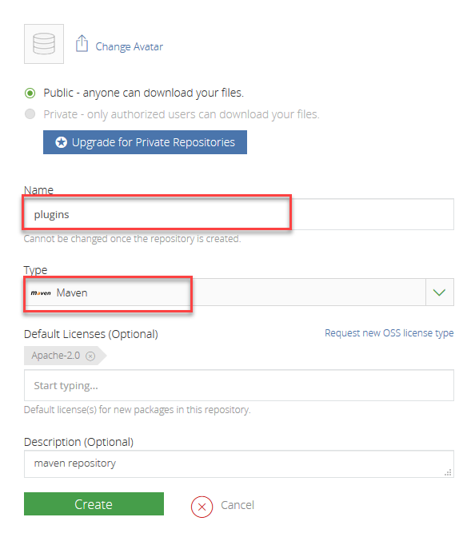
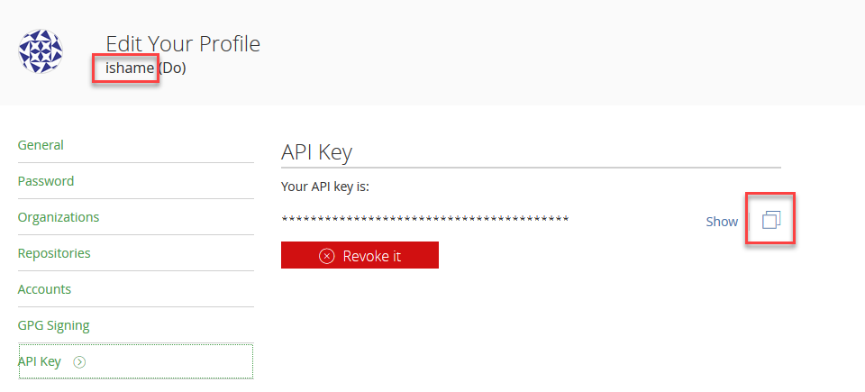

# Grails - Publish plugin 

Just a simple guide for getting started with Grails 3 plugin.

## On the distribution

Grails 3 plugins are distributed through Bintray, so first signup/signin to https://bintray.com (one-click signin with GitHub or Twitter),

Create a new maven repository called plugins on your account

Edit your Bintray profile to get your personal API Key

Add BINTRAY_USER and BINTRAY_KEY to your env variables

	BINTRAY_USER=ishame
	BINTRAY_KEY=xxxxxxxxxxxxxxxxxx

## On the Grails plugin

create a plugin by command

	grails create-plugin sample-plugin,

create a service in the plugin

	cd sample-plugin
	grails create-service Name

edit method within the service `grails-app/services/myplugin/NameService.groovy`

   	class NameService {

        def name() {
            'Grails.3x Plugin'
        }
    }

edit `build.gradle`

	grailsPublish {
	    user = System.getProperty('BINTRAY_USER')
	    key = System.getProperty('BINTRAY_KEY')
	    githubSlug = 'user/repository'
	    license {
	        name = 'Apache-2.0'
	    }
	    title = "sample-plugin"
	    desc = "Grails sample-plugin plugin"
	    developers = [hoge:"Hoge Hoge"]
	}

simply run `gradle bintrayUpload` from your project root.

## On the app which use plugin

Create and edit `build.gradle`

	// Replace benorama by your user/organization name
	repositories {
	  ...
	  maven { url "https://dl.bintray.com/ishame/plugins" }
	}
	dependencies {
	  ...
	  compile "org.grails.plugins:sample-plugin:0.1"
	}

